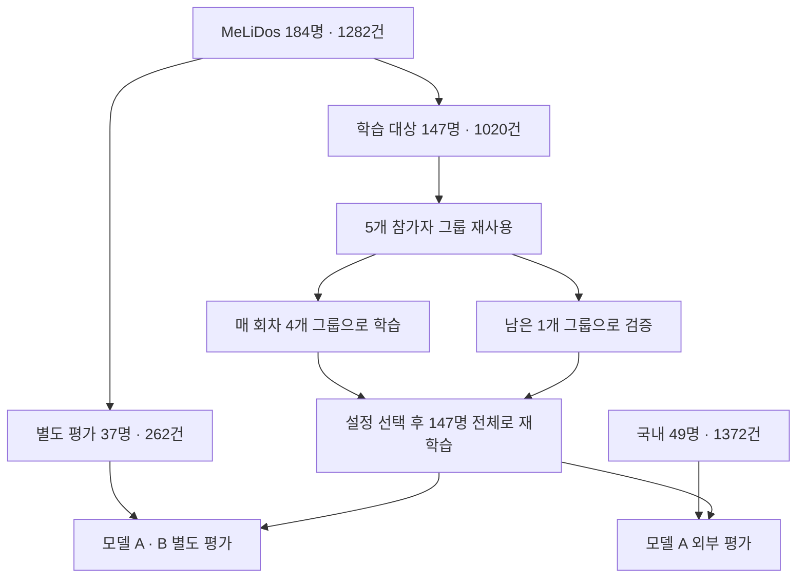

# 데이터 분할

```mermaid
flowchart TD
    M[MeLiDos 184명 · 1282건] --> T[학습 대상 147명 · 1020건]
    M --> H[별도 평가 37명 · 262건]
    T --> CV[5개 참가자 그룹 재사용]
    CV --> TR[매 회차 4개 그룹으로 학습]
    CV --> V[남은 1개 그룹으로 검증]
    TR --> FIX[설정 선택 후 147명 전체로 재학습]
    V --> FIX
    K[국내 49명 · 1372건] --> EXT[모델 A 외부 평가]
    H --> HOLD[모델 A · B 별도 평가]
    FIX --> HOLD
    FIX --> EXT
```

5회 전체에서 각 학습 참가자는 검증에 한 번씩 포함된다. 국내 마지막 7일은 343건이며, 해당 밤 이전의 실제 일지를 사용할 수 있는 평가 조건이다. 국내 B 정답은 없다.

[분할 파일 안내](../데이터/데이터%20파일%20설명.md)
