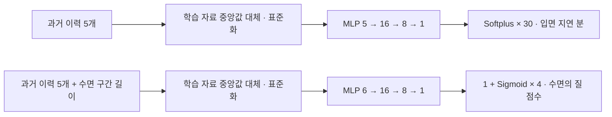

# 최종 모델 A · B 구조

```mermaid
flowchart LR
    A[과거 이력 5개] --> AP[학습 자료 중앙값 대체 · 표준화]
    AP --> AN[MLP 5 → 16 → 8 → 1]
    AN --> AO[Softplus × 30 · 입면 지연 분]
    B[과거 이력 5개 + 수면 구간 길이] --> BP[학습 자료 중앙값 대체 · 표준화]
    BP --> BN[MLP 6 → 16 → 8 → 1]
    BN --> BO[1 + Sigmoid × 4 · 수면의 질 점수]
```

은닉층은 ReLU를 사용하며, 첫 은닉층 뒤에 Dropout 0.1을 적용한다. 세 난수 시드의 예측을 평균한다. 두 모델은 독립적으로 학습한다.

[모델 구현](../코드/mlp.py) · [최종 선택 설정](../실험결과/교차검증/selection.json)
