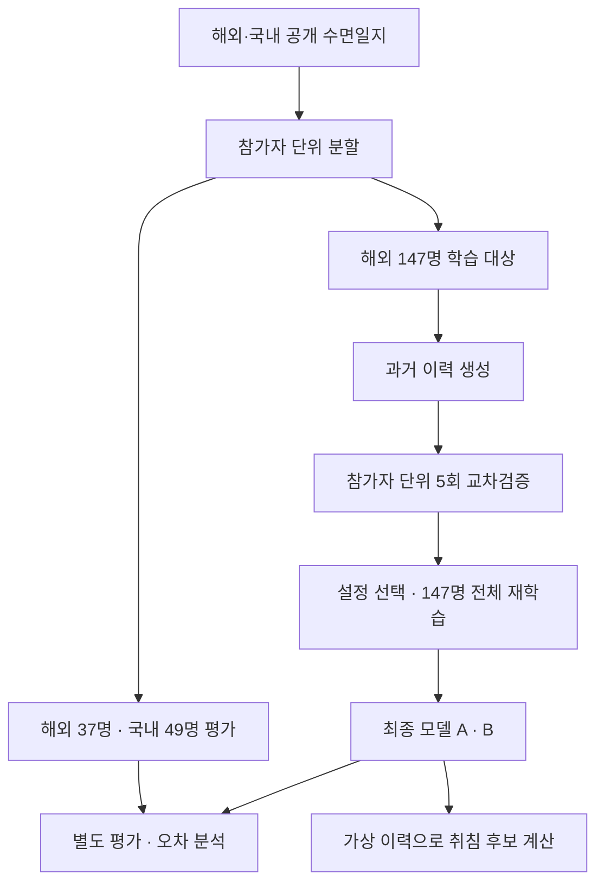

# 프로젝트 전체 흐름

```mermaid
flowchart TD
    RAW[해외·국내 공개 수면일지] --> SPLIT[참가자 단위 분할]
    SPLIT --> TRAIN[해외 147명 학습 대상]
    SPLIT --> TEST[해외 37명 · 국내 49명 평가]
    TRAIN --> PREP[과거 이력 생성]
    PREP --> CV[참가자 단위 5회 교차검증]
    CV --> SELECT[설정 선택 · 147명 전체 재학습]
    SELECT --> MODEL[최종 모델 A · B]
    TEST --> EVAL[별도 평가 · 오차 분석]
    MODEL --> EVAL
    MODEL --> DEMO[가상 이력으로 취침 후보 계산]
```

[전처리·학습 코드](../코드/코드%20파일%20설명.md) · [Technical Blog](../README.md)
